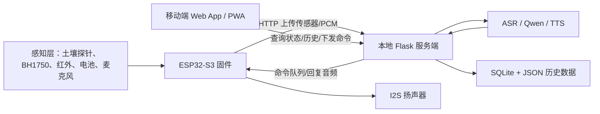
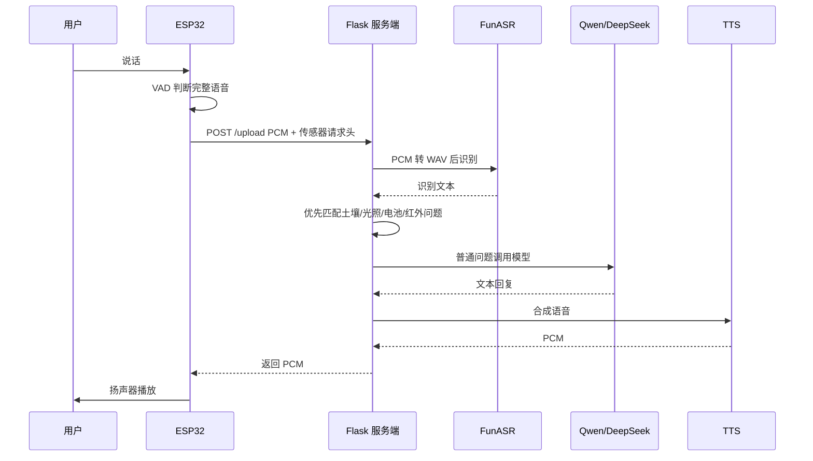

# 基于 ESP32 的智能蔬菜大棚系统技术文档

## 1. 项目概述

本项目是一个面向蔬菜大棚环境监测与智能交互的物联网系统。系统以 ESP32-S3 为感知与控制核心，通过土壤多合一探针、BH1750 光照传感器、人体红外模块、数字麦克风、I2S 扬声器、RGB 状态灯、按键和电池检测模块完成现场数据采集与状态反馈；通过 WiFi 与本地 Flask 服务端通信；通过移动端 Web App 展示设备状态、传感器数据、历史趋势并触发远程采集。

系统当前重点实现以下能力：

- 大棚环境数据采集：土壤温度、土壤湿度、电导率、盐分、氮、磷、钾、pH、光照强度、人体红外状态、电池状态。
- 设备端语音交互：ESP32 采集 16 kHz PCM 语音，上传服务端进行 ASR、AI 回复与 TTS，再播放返回音频。
- 移动端控制与展示：浏览器或 PWA 访问本地服务，查看实时状态、历史趋势、告警和设备信息。
- 数据持久化：服务端用 SQLite 保存传感器历史记录，并保留 JSON 备份。
- 局域网通信：ESP32 与移动端都通过本地 Flask 服务端协同，不依赖公网服务器即可完成核心流程。

## 2. 目录结构

```text
smart-bird-project/
├─ smart-bird-EPS32/              # ESP32-S3 固件工程
│  ├─ main/                       # 固件入口 app_main
│  ├─ components/
│  │  ├─ AI/                      # HTTP 通信、语音上传、音频拉取、定时采集
│  │  ├─ Battery/                 # 电池 ADC 检测
│  │  ├─ Button/                  # 按键静音、休眠、唤醒
│  │  ├─ Config/                  # WiFi、服务器、引脚、采样参数配置
│  │  ├─ IR/                      # HC-SR501 人体红外
│  │  ├─ LS/                      # BH1750 光照传感器
│  │  ├─ SoilProbe/               # UART/Modbus RTU 土壤探针
│  │  ├─ Sound/                   # MAX98357A I2S 扬声器播放
│  │  ├─ Speek/                   # INMP441 I2S 麦克风与 VAD
│  │  └─ StatusLED/               # RGB 状态灯
│  ├─ README.md                   # ESP32 工程运行说明
│  ├─ SOIL_PROBE_WIRING.md        # 土壤探针接线说明
│  ├─ BUTTON_RGB_WIRING.md        # 按键与 RGB 接线说明
│  └─ BATTERY_WIRING.md           # 电池检测接线说明
│
├─ smart-bird-server/
│  ├─ server/
│  │  ├─ app.py                   # Flask 服务、AI 流水线、接口、数据存储
│  │  ├─ requirements.txt         # Python 依赖
│  │  └─ work/                    # 音频、缓存、历史数据库等运行数据
│  ├─ App/
│  │  ├─ index.html               # 移动端页面
│  │  ├─ app.js                   # 移动端业务逻辑
│  │  ├─ styles.css               # 移动端样式
│  │  ├─ manifest.json            # PWA 配置
│  │  └─ service-worker.js        # 离线缓存
│  └─ run_server.ps1              # 服务端启动脚本
│
├─ setup_project.ps1              # 项目依赖初始化脚本
├─ use_project_deps.ps1           # 项目依赖环境加载脚本
└─ TECHNICAL_DOCUMENTATION.md     # 当前技术文档
```

## 3. 总体架构



系统采用三层协作方式：

1. 感知与执行层：ESP32-S3 负责采集、初步状态判断、音频输入输出、RGB 灯提示、按键控制和 HTTP 通信。
2. 服务与智能层：Flask 负责接口服务、设备状态管理、历史数据持久化、语音识别、大模型回复和语音合成。
3. 展示与控制层：移动端 App 负责设备状态查看、趋势图显示、语音上传、立即采集和告警展示。

## 4. 硬件组成与接线

### 4.1 主控与核心外设

| 模块 | 型号/方案 | 通信方式 | 主要作用 |
| --- | --- | --- | --- |
| 主控 | ESP32-S3-MINI-1-N8 | WiFi / GPIO / I2C / I2S / UART / ADC | 数据采集、网络通信、语音交互、控制调度 |
| 光照传感器 | BH1750 | I2C | 采集大棚光照强度，单位 lux |
| 土壤探针 | 土壤多合一探针 | UART / Modbus RTU | 采集土壤温度、湿度、EC、盐分、氮磷钾、pH |
| 人体红外 | HC-SR501 | GPIO | 判断人员靠近状态 |
| 麦克风 | INMP441 | I2S 输入 | 采集语音 PCM |
| 扬声器功放 | MAX98357A | I2S 输出 | 播放提示音与 AI 回复 |
| 状态灯 | 四脚 RGB LED | GPIO 输出 | 显示网络、电池、运行状态 |
| 按键 | 三脚按键模块 | GPIO 输入 | 静音、休眠、唤醒 |
| 电池检测 | 单节锂电池 + 分压 | ADC | 采集电池电压与估算电量 |

### 4.2 土壤探针接线

默认配置：

| 配置项 | 当前值 |
| --- | --- |
| 探针地址 | `0x02` |
| 波特率 | `9600` |
| 串口 | `UART1` |
| ESP32 接收引脚 | `GPIO18` |
| ESP32 发送引脚 | `GPIO21` |
| 寄存器范围 | 从 `0x0000` 开始读 8 个寄存器 |

TTL 探针接线：

| 探针线 | ESP32 |
| --- | --- |
| V+ | 按探针要求供电 |
| GND | GND |
| TX | `GPIO18` |
| RX | `GPIO21` |

RS485 探针需要增加 RS485 转 UART 模块：

| RS485 模块 | ESP32 |
| --- | --- |
| RO/TX | `GPIO18` |
| DI/RX | `GPIO21` |
| VCC | 3.3V 或 5V，按模块要求 |
| GND | GND |
| A/B | 接探针 A+/B- |

注意事项：

- 不要把 12V 或 24V 探针电源直接接到 ESP32 GPIO。
- 如果 RS485 模块没有自动收发方向控制，需要配置 `BIRD_SOIL_PROBE_DE_PIN`。
- 若串口提示 `response timeout`，优先检查 A/B 是否接反、供电是否稳定、地址是否为 `0x02`、波特率是否为 `9600`。

### 4.3 RGB 与按键接线

RGB LED 默认按四脚共阴模块配置：

| RGB 引脚 | ESP32-S3 |
| --- | --- |
| R | `GPIO4` |
| G | `GPIO5` |
| B | `GPIO8` |
| GND / - | GND |

按键模块接线：

| 按键引脚 | ESP32-S3 |
| --- | --- |
| VCC | 3.3V |
| GND | GND |
| OUT | `GPIO9` |

当前行为：

- 开机初始化：蓝色呼吸。
- WiFi 未连接：蓝色呼吸。
- WiFi 已连接：蓝色常亮。
- 低电量：琥珀色常亮。
- 充电中：琥珀色呼吸。
- 电池已满：蓝色常亮。
- 短按：扬声器静音或取消静音。
- 长按 2 秒后松开：进入 light sleep 并关闭 LED。
- 休眠后再次按键：唤醒并重启应用。

### 4.4 电池检测接线

不要将电池正极或 5V 输出直接接到 ESP32 ADC。

当前检测方式为 1K + 1K 电阻分压：

```text
Battery B+ ---- 1K ---- GPIO3 ---- 1K ---- GND
```

| 信号 | ESP32-S3 |
| --- | --- |
| 电池分压中点 | `GPIO3 / ADC1_CH2` |
| 电池或模块 GND | GND |

两个 1K 电阻为 1:1 分压，满电 4.2V 到 GPIO3 约为 2.1V。不要只用一个 1K 电阻串到 ADC，
也不要把电池正极或 5V OUT+ 直接接到 GPIO3。

默认软件参数：

| 参数 | 当前值 |
| --- | --- |
| 电池容量 | `2500 mAh` |
| 低电量阈值 | `5%` |
| 有效电压范围 | `3000 mV` 到 `4300 mV` |
| 满电参考电压 | `4150 mV` |

### 4.5 音频模块接线

当前 README 中给出的音频引脚：

| 模块 | 信号 | ESP32-S3 |
| --- | --- | --- |
| INMP441 麦克风 | SCK | `GPIO10` |
| INMP441 麦克风 | WS | `GPIO11` |
| INMP441 麦克风 | SD | `GPIO12` |
| MAX98357A 扬声器 | BCLK | `GPIO15` |
| MAX98357A 扬声器 | LRC | `GPIO16` |
| MAX98357A 扬声器 | DOUT | `GPIO17` |

音频参数：

| 参数 | 当前值 |
| --- | --- |
| 采样率 | `16000 Hz` |
| 声道 | 单声道 |
| 采样格式 | `pcm_s16le` |
| 最大录音长度 | 5 秒 |

## 5. ESP32 固件说明

### 5.1 启动流程

固件入口位于 `smart-bird-EPS32/main/main.c`。启动顺序如下：

1. 初始化 RGB 状态灯，显示开机状态。
2. 初始化电池检测模块。
3. 初始化扬声器、按键并播放测试音。
4. 初始化红外、光照、土壤探针等本地传感器。
5. 连接 WiFi。
6. 初始化麦克风和 AI 通信模块。
7. 启动远程音频轮询任务和定时采集任务。
8. 主循环持续执行语音活动检测，检测到完整语音后上传服务端。

关键逻辑示例：

```c
void app_main(void)
{
    status_led_init();                  // 初始化状态灯，用于显示设备运行状态
    Battery_init();                     // 初始化电池检测，后续随 HTTP 头上报
    Sound_init(BIRD_SAMPLE_RATE);       // 初始化 I2S 扬声器输出
    button_init();                      // 初始化按键，用于静音、休眠和唤醒

    IR_init();                          // 初始化人体红外模块
    LS_init();                          // 初始化 BH1750 光照模块
    SoilProbe_init();                   // 初始化土壤多合一探针

    wifi_connect(BIRD_WIFI_SSID, BIRD_WIFI_PASSWORD); // 连接局域网
    speek_init(BIRD_SAMPLE_RATE);                      // 初始化麦克风采集与 VAD
    ai_init(BIRD_SERVER_IP, BIRD_SERVER_PORT);         // 初始化服务端地址
    ai_start_remote_audio();                           // 启动远程音频与定时采集任务

    while (1) {
        voice_task();                   // 持续监听语音输入
        vTaskDelay(pdMS_TO_TICKS(20));  // 控制循环周期，避免长期占满 CPU
    }
}
```

### 5.2 主要组件职责

| 组件 | 核心职责 |
| --- | --- |
| `Config` | 统一管理 WiFi、服务器、引脚、音频、采集周期、电池阈值等配置 |
| `WIFI` | 连接指定 SSID，并为 HTTP 通信提供网络基础 |
| `AI` | 构造 HTTP 请求、上传 PCM、上报传感器头、拉取回复音频、轮询命令 |
| `Speek` | 麦克风采集、语音活动检测、触发音频上传 |
| `Sound` | I2S PCM 播放、测试音、静音、打断播放 |
| `LS` | 初始化 I2C，读取 BH1750 lux 数据 |
| `SoilProbe` | UART/Modbus RTU 查询土壤探针并校验 CRC |
| `IR` | 读取 HC-SR501 高低电平 |
| `Battery` | ADC 读取电池分压并估算电压、电量 |
| `StatusLED` | RGB 灯状态机 |
| `Button` | 按键消抖、短按静音、长按休眠 |

### 5.3 核心配置项

配置文件：`smart-bird-EPS32/components/Config/include/bird_test_config.h`

| 配置项 | 说明 | 当前值 |
| --- | --- | --- |
| `BIRD_WIFI_SSID` | WiFi 名称 | 空，烧录前需配置或构建时覆盖 |
| `BIRD_WIFI_PASSWORD` | WiFi 密码 | 空，烧录前需配置或构建时覆盖 |
| `BIRD_SERVER_IP` | 电脑服务端 IP | 空，烧录前需配置或构建时覆盖 |
| `BIRD_SERVER_PORT` | 服务端端口 | `8010` |
| `BIRD_SAMPLE_RATE` | 音频采样率 | `16000` |
| `BIRD_VAD_THRESHOLD` | 语音活动检测阈值 | `420` |
| `BIRD_MAX_RECORD_SAMPLES` | 最大录音采样数 | 5 秒 |
| `BIRD_SPEAKER_VOLUME_PERCENT` | 扬声器音量 | `50` |
| `BIRD_COLLECT_INTERVAL_SECONDS` | 自动采集周期 | `7200` 秒 |
| `BIRD_SOIL_PROBE_ADDR` | 土壤探针地址 | `0x02` |
| `BIRD_SOIL_PROBE_BAUD` | 土壤探针波特率 | `9600` |

### 5.4 HTTP 上报字段

ESP32 在上传语音、轮询音频、轮询命令、触发采集时，会把传感器状态放入 HTTP 请求头：

| 请求头 | 含义 | 单位/换算 |
| --- | --- | --- |
| `X-IR-Raw` | 红外原始值 | `0` 或 `1` |
| `X-Light-Lux-X10` | 光照强度 | 服务端除以 10 得到 lux |
| `X-Soil-Temp-X10` | 土壤温度 | 服务端除以 10 得到摄氏度 |
| `X-Soil-Humidity-X10` | 土壤湿度 | 服务端除以 10 得到百分比 |
| `X-Soil-Ec` | 土壤电导率 | us/cm |
| `X-Soil-Salt` | 盐分 | ppm |
| `X-Soil-N` | 氮 | mg/kg |
| `X-Soil-P` | 磷 | mg/kg |
| `X-Soil-K` | 钾 | mg/kg |
| `X-Soil-Ph-X10` | pH | 服务端除以 10 |
| `X-Battery-Voltage-Mv` | 电池电压 | mV |
| `X-Battery-Percent` | 电池百分比 | `%` |
| `X-Battery-Low` | 是否低电量 | `0` 或 `1` |
| `X-Battery-Charging` | 是否充电中 | `0` 或 `1` |
| `X-Battery-Full` | 是否满电 | `0` 或 `1` |

### 5.5 固件编译与烧录

推荐先在项目根目录加载依赖：

```powershell
cd F:\Program\smart-bird-project
.\setup_project.ps1
. .\use_project_deps.ps1
```

配置 ESP32 工程：

```powershell
cd F:\Program\smart-bird-project\smart-bird-EPS32
$env:BIRD_WIFI_SSID="你的WiFi名称"
$env:BIRD_WIFI_PASSWORD="你的WiFi密码"
$env:BIRD_SERVER_IP="你的电脑局域网IP"
$env:BIRD_SERVER_PORT="8010"
idf.py set-target esp32s3
idf.py build
idf.py -p COMx flash monitor
```

也可以直接修改 `bird_test_config.h`，但更推荐用环境变量覆盖，避免把个人 WiFi 密码写入代码。

## 6. 服务端说明

### 6.1 服务端职责

服务端入口：`smart-bird-server/server/app.py`

服务端承担以下职责：

- 提供 Flask HTTP API。
- 托管移动端 Web App 静态文件。
- 接收 ESP32 上传的 PCM 语音和传感器状态。
- 将 PCM 转 WAV，交给 ASR 模型识别。
- 对土壤、光照、电池、红外等问题优先用最新传感器数据直接回复。
- 对普通问题调用本地 Qwen 或 DeepSeek。
- 将回复文本转换为 16 kHz 单声道 PCM，返回 ESP32 或加入待播放队列。
- 保存传感器历史到 SQLite，并维护 JSON 备份。
- 维护移动端命令队列和 ESP32 待播放音频队列。

### 6.2 环境变量

| 环境变量 | 说明 | 默认值/建议 |
| --- | --- | --- |
| `BIRD_PROJECT_ROOT` | 项目根目录 | 当前项目根目录 |
| `BIRD_SERVER_HOST` | Flask 监听地址 | `0.0.0.0` |
| `BIRD_SERVER_PORT` | Flask 端口 | `8000`，项目常用 `8010` |
| `BIRD_SERVER_WORK_DIR` | 音频和运行缓存目录 | `server/work` |
| `BIRD_DB_PATH` | SQLite 数据库路径 | `work/bird_history.db` |
| `BIRD_HISTORY_PATH` | JSON 历史备份 | `work/sensor_history.json` |
| `BIRD_MOBILE_APP_DIR` | 移动端静态文件目录 | `smart-bird-server/App` |
| `ASR_PROVIDER` | 语音识别提供者 | `funasr` 或 `fallback` |
| `ASR_FALLBACK_TEXT` | fallback 识别文本 | 调试用 |
| `LLM_PROVIDER` | 语义处理提供者 | `qwen_local`、`deepseek`、`fallback` |
| `LOCAL_QWEN_MODEL` | 本地 Qwen 模型路径 | 使用本地 Qwen 时必填 |
| `DEEPSEEK_API_KEY` | DeepSeek API Key | 使用 DeepSeek 时必填 |
| `TTS_PROVIDER` | 语音合成提供者 | Windows SAPI 或其他实现 |
| `FFMPEG_PATH` | ffmpeg 路径 | 手机录音解码需要 |

### 6.3 启动服务端

推荐方式：

```powershell
cd F:\Program\smart-bird-project
.\setup_project.ps1
cd .\smart-bird-server
.\run_server.ps1
```

若需要手动启动：

```powershell
cd F:\Program\smart-bird-project
. .\use_project_deps.ps1
cd .\smart-bird-server\server
python app.py
```

启动成功后，浏览器访问：

```text
http://电脑IP:8010/app/
```

ESP32 固件中的 `BIRD_SERVER_IP` 必须配置为同一台电脑的局域网 IP。

### 6.4 服务端接口

| 路径 | 方法 | 调用方 | 说明 |
| --- | --- | --- | --- |
| `/health` | GET | 移动端/调试 | 服务健康检查，返回采样率、AI 提供者、采集周期 |
| `/` | GET | 浏览器 | 重定向到 `/app/` |
| `/app/` | GET | 浏览器 | 移动端首页 |
| `/app/<path>` | GET | 浏览器 | 移动端静态资源 |
| `/device/status` | GET | 移动端 | 查询设备在线、传感器、电池、队列和历史统计 |
| `/device/pending` | GET | ESP32 | 轮询是否有手机端生成的待播放音频 |
| `/device/command` | GET | ESP32 | 轮询手机端下发的控制命令 |
| `/device/collect` | POST | ESP32 | 主动上传一次传感器采集结果 |
| `/app/collect` | POST | 移动端 | 手机端请求 ESP32 立即采集 |
| `/device/history?limit=100` | GET | 移动端 | 获取历史传感器数据 |
| `/app/voice` | POST | 移动端 | 上传手机录音，服务端生成回复后放入 ESP32 播放队列 |
| `/upload` | POST | ESP32 | 上传麦克风 PCM，服务端直接返回回复 PCM |
| `/audio/<name>` | GET | 调试 | 读取 work/cache 中的音频文件 |

#### `/device/status` 返回字段示例

```json
{
  "online": true,
  "last_seen": 1710000000.0,
  "ir_raw": 0,
  "lux": 325.4,
  "soil_temperature": 25.1,
  "soil_humidity": 43.2,
  "soil_ec": 1200,
  "soil_salt": 80,
  "soil_nitrogen": 40,
  "soil_phosphorus": 30,
  "soil_potassium": 90,
  "soil_ph": 6.8,
  "soil_valid": true,
  "battery_voltage_mv": 3920,
  "battery_percent": 68,
  "battery_low": false,
  "pending_audio": 0,
  "pending_commands": 0
}
```

## 7. 移动端 App 使用说明

移动端位于 `smart-bird-server/App`，由 Flask 通过 `/app/` 提供访问。它是 Web App / PWA，可以直接浏览器打开，也可部署到 HTTPS 后添加到手机桌面。

### 7.1 首次连接

1. 确保电脑、手机和 ESP32 连接同一个 WiFi。
2. 电脑启动服务端。
3. 手机浏览器访问 `http://电脑IP:8010/app/`。
4. 如果页面不是由 8010 端口服务直接打开，需要在页面中填写服务地址，例如：

```text
http://192.168.1.10:8010
```

### 7.2 页面功能

| 页面 | 功能 |
| --- | --- |
| 设备总览 | 显示在线状态、WiFi、心跳、电池、光照、人体感应、土壤主要指标 |
| 局域网连接 | 设置服务端地址，查看延迟和最近心跳时间 |
| 传感器采集 | 查看光照、红外、土壤温度、湿度、EC、盐分、氮磷钾、pH |
| 趋势图 | 显示最近历史数据趋势 |
| 语音与对话 | 手机录音上传服务端，AI 回复进入 ESP32 播放队列 |
| 设备控制 | 立即采集、部分预留控制项 |
| 告警与提醒 | 显示低电量、设备离线、人体感应等提醒 |
| 设备信息 | 展示产品 ID、固件、协议等基础信息 |

### 7.3 立即采集流程

1. 手机点击“立即采集”。
2. 移动端调用 `/app/collect`。
3. 服务端将 `collect:app` 放入命令队列。
4. ESP32 轮询 `/device/command` 取走命令。
5. ESP32 调用土壤探针、光照、红外、电池模块读取数据。
6. ESP32 POST `/device/collect`。
7. 服务端写入 SQLite 和 JSON。
8. 移动端轮询 `/device/status` 和 `/device/history` 后刷新页面。

### 7.4 手机语音流程

1. 手机端按住说话。
2. 浏览器 `MediaRecorder` 录音，松手后上传 `/app/voice`。
3. 服务端用 ffmpeg 转换音频为 16 kHz 单声道 WAV。
4. ASR 得到文本。
5. 服务端根据文本生成回复。
6. TTS 生成 PCM。
7. 回复音频进入 `_device_audio_queue`。
8. ESP32 轮询 `/device/pending` 后下载并播放。

## 8. 语音 AI 流程

### 8.1 ESP32 麦克风语音流程



### 8.2 回复优先级

服务端 `create_reply()` 的回复优先级如下：

1. 电池问题：如“电量多少”“是不是低电量”。
2. 土壤问题：如“土壤湿度多少”“pH 多少”“氮磷钾多少”。
3. 普通传感器问题：如“光照怎么样”“有没有人”。
4. 大模型回复：其余普通问答。

这样做可以减少大模型调用次数，提高传感器类问题的准确性和响应速度。

## 9. 数据存储

### 9.1 SQLite 表结构

服务端会创建 `sensor_history` 表，核心字段如下：

| 字段 | 类型 | 说明 |
| --- | --- | --- |
| `id` | INTEGER | 自增主键 |
| `collected_at` | REAL | 采集时间戳 |
| `source` | TEXT | 来源，如 `boot`、`scheduled`、`app` |
| `ir_raw` | INTEGER | 红外原始值 |
| `lux` | REAL | 光照强度 |
| `soil_temperature` | REAL | 土壤温度 |
| `soil_humidity` | REAL | 土壤湿度 |
| `soil_ec` | INTEGER | 电导率 |
| `soil_salt` | INTEGER | 盐分 |
| `soil_nitrogen` | INTEGER | 氮 |
| `soil_phosphorus` | INTEGER | 磷 |
| `soil_potassium` | INTEGER | 钾 |
| `soil_ph` | REAL | pH |
| `soil_valid` | INTEGER | 土壤数据是否有效 |
| `battery_voltage_mv` | INTEGER | 电池电压 |
| `battery_percent` | INTEGER | 电量百分比 |
| `battery_low` | INTEGER | 是否低电量 |
| `created_at` | REAL | 记录写入时间 |

### 9.2 历史数据策略

- 内存队列最多保留 500 条最近采样。
- SQLite 用于长期保存。
- JSON 文件作为兼容和备份。
- `/device/history?limit=100` 默认返回最近 100 条，最大限制 500 条。

## 10. 常用运行流程

### 10.1 完整启动顺序

1. 接好 ESP32、传感器、扬声器、麦克风和电池检测线路。
2. 启动电脑服务端。
3. 确认服务端显示 AI models ready 或 voice AI ready。
4. 配置并烧录 ESP32 固件。
5. 打开 ESP32 串口监视器。
6. 手机访问 `/app/`。
7. 点击“立即采集”验证传感器。
8. 对 ESP32 麦克风说话，验证语音问答。
9. 用手机按住说话，验证手机端语音到 ESP32 播放队列。

### 10.2 快速健康检查

浏览器打开：

```text
http://电脑IP:8010/health
```

如果返回 `ok: true`，说明电脑服务可访问。

查看设备状态：

```text
http://电脑IP:8010/device/status
```

如果 `online: true`，说明 ESP32 正在通过轮询或上传维持心跳。

### 10.3 串口日志重点

常见正常日志：

```text
I SoilProbe: temp=25.1 hum=43.2 ec=...
I AI: collect source=boot status=200
[ASR RESULT] 土壤湿度多少
[AI RESULT] 当前土壤湿度...
```

常见异常日志：

| 日志 | 可能原因 | 处理方式 |
| --- | --- | --- |
| `WiFi failed` | SSID、密码、信号或网络配置错误 | 检查 `BIRD_WIFI_SSID` 和 `BIRD_WIFI_PASSWORD` |
| `collect skipped, AI channel busy` | 语音上传和采集同时占用 HTTP 通道 | 等待当前任务结束后重试 |
| `soil probe read skipped/failed` | 探针读取失败 | 检查供电、TX/RX、地址、波特率 |
| `response timeout` | 土壤探针无响应 | 检查 A/B、TTL 交叉线、探针电源 |
| `bad response` | Modbus 地址、功能码、字节数或 CRC 不匹配 | 核对探针协议和地址 |
| `bad response status` | 服务端返回非 200 | 检查服务端日志和接口状态 |

## 11. 常见问题与处理

### 11.1 手机页面打不开

检查项：

- 电脑服务端是否已启动。
- 手机与电脑是否在同一 WiFi。
- Windows 防火墙是否允许 Python/Flask 端口访问。
- 页面地址是否包含端口，例如 `http://192.168.1.10:8010/app/`。

### 11.2 ESP32 显示离线

可能原因：

- ESP32 未成功连接 WiFi。
- `BIRD_SERVER_IP` 配置错误。
- 服务端端口和固件端口不一致。
- 电脑 IP 改变。
- ESP32 与电脑不在同一局域网。

处理方式：

1. 在电脑运行 `ipconfig` 获取当前 IPv4。
2. 更新 ESP32 配置中的 `BIRD_SERVER_IP`。
3. 重新烧录或用环境变量重新构建。
4. 查看串口是否出现 `/device/pending`、`/device/command` 或 `/upload` 相关日志。

### 11.3 土壤数据不显示

检查项：

- 探针是否供电。
- 探针地址是否为 `0x02`。
- 波特率是否为 `9600`。
- ESP32 TX 是否接探针 RX，ESP32 RX 是否接探针 TX。
- RS485 的 A/B 是否接反。
- RS485 模块是否需要 DE/RE 方向控制。

### 11.4 光照数据不显示

检查项：

- BH1750 的 SDA/SCL 是否接到配置引脚。
- 传感器地址是否匹配。
- I2C 是否需要上拉。
- 模块供电是否为 3.3V 或模块允许的电压。

### 11.5 语音识别不准

优化方向：

- 减小扬声器音量，避免回声进入麦克风。
- 增加麦克风与扬声器距离。
- 避开风扇、水泵等噪声源。
- 调整 VAD 阈值 `BIRD_VAD_THRESHOLD`。
- 调整录音最大长度和静音帧数。
- 服务端对常用指令增加关键词匹配。

### 11.6 手机语音上传失败

检查项：

- 浏览器是否允许麦克风权限。
- 是否配置 `FFMPEG_PATH`。
- 服务端是否能执行 ffmpeg。
- `/app/voice` 是否返回 500。
- `server/work` 是否有写入权限。

## 12. 二次开发建议

### 12.1 增加自动灌溉

可以增加继电器或 MOSFET 控制水泵：

1. 增加 `Pump` 组件。
2. 在 `Config` 中配置水泵 GPIO 和安全工作时长。
3. 服务端新增 `/app/pump` 命令接口。
4. ESP32 在 `/device/command` 中解析 `pump_on`、`pump_off`。
5. 根据土壤湿度阈值自动触发或提醒人工确认。

建议水泵控制增加硬件保护：

- 继电器隔离。
- 反接保护。
- 超时关闭。
- 低电量禁止启动。
- 水泵状态上报移动端。

### 12.2 增加补光控制

可以根据 BH1750 数据判断是否需要补光：

```c
float lux = LS_Get_Lux();              // 读取当前光照强度
if (lux >= 0 && lux < 200) {           // 低于阈值时认为光照不足
    // 打开补光灯，实际实现时应加入继电器或 MOSFET 控制
}
```

### 12.3 增加阈值配置

当前阈值主要写在固件或服务端逻辑中。后续可在移动端增加配置页面，将阈值保存在服务端，再由 ESP32 定期拉取：

- 土壤湿度下限。
- 光照下限。
- pH 合理范围。
- 电导率告警范围。
- 自动采集间隔。
- 低电量阈值。

### 12.4 安全与稳定性建议

当前系统默认面向局域网课程设计和实物演示。如果用于长期运行，建议增加：

- 接口鉴权，例如简单 token 或局域网白名单。
- 请求体大小限制，防止异常音频占满磁盘。
- 音频 work 目录定期清理。
- SQLite 定期备份。
- ESP32 看门狗和异常重连。
- 传感器数据范围校验。
- 移动端控制命令确认机制。

## 13. 交付与演示建议

演示时建议按以下顺序展示：

1. 打开移动端 App，展示服务端在线但设备未连接状态。
2. 给 ESP32 上电，展示状态灯变化和设备上线。
3. 点击“立即采集”，展示土壤、光照、电池数据刷新。
4. 遮挡或增强光照，展示 BH1750 数据变化。
5. 靠近红外模块，展示人体感应状态变化。
6. 对 ESP32 麦克风询问“土壤湿度多少”“光照是否正常”。
7. 用手机按住说话，展示手机语音上传后由 ESP32 扬声器播放回复。
8. 展示历史趋势图和告警列表。

## 14. 关键文件索引

| 文件 | 用途 |
| --- | --- |
| `smart-bird-EPS32/main/main.c` | 固件启动入口 |
| `smart-bird-EPS32/components/Config/include/bird_test_config.h` | 关键配置 |
| `smart-bird-EPS32/components/AI/AI.c` | ESP32 HTTP 和 AI 通信 |
| `smart-bird-EPS32/components/SoilProbe/SoilProbe.c` | 土壤探针 Modbus RTU |
| `smart-bird-EPS32/components/LS/LS.c` | BH1750 光照读取 |
| `smart-bird-EPS32/components/Speek/Speek.c` | 麦克风采集与 VAD |
| `smart-bird-EPS32/components/Sound/Sound.c` | I2S 音频播放 |
| `smart-bird-server/server/app.py` | Flask 服务、接口和 AI 流程 |
| `smart-bird-server/App/app.js` | 移动端业务逻辑 |
| `smart-bird-server/App/index.html` | 移动端页面结构 |
| `smart-bird-server/App/styles.css` | 移动端样式 |
| `smart-bird-EPS32/SOIL_PROBE_WIRING.md` | 土壤探针接线 |
| `smart-bird-EPS32/BUTTON_RGB_WIRING.md` | 按键与 RGB 接线 |
| `smart-bird-EPS32/BATTERY_WIRING.md` | 电池检测接线 |
